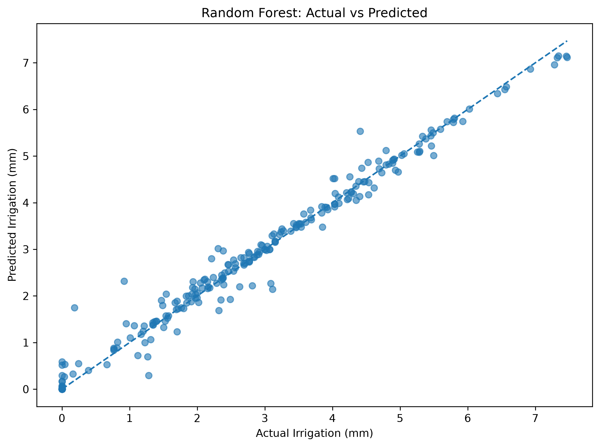
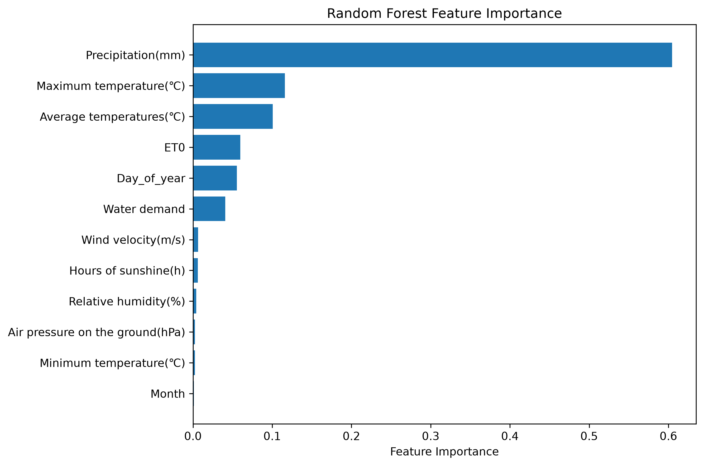
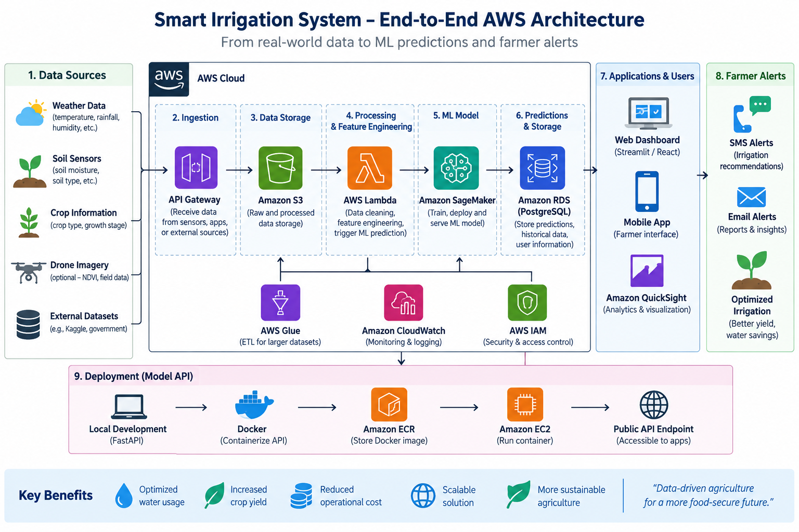

# Smart Irrigation Water Recommendation System

End-to-end Machine Learning project for predicting recommended irrigation amounts using meteorological and agricultural data.

## Project Objective

The goal of this project is to build a smart irrigation recommendation system capable of estimating the amount of irrigation water required based on environmental conditions.

The project covers the full Data Science and Machine Learning lifecycle:

- Data exploration
- Feature engineering
- Time-based validation
- Machine Learning model development
- Model evaluation
- API development
- Docker containerization
- AWS cloud deployment

## Dataset

### Data Source

The project uses the supplementary raw dataset from the scientific study:

**An accurate irrigation volume prediction method based on an optimized LSTM model**  
PeerJ Computer Science, 2024.

The dataset contains historical meteorological and irrigation-related observations from 2000 to 2022.

Main variables include:

- Air pressure
- Average temperature
- Maximum temperature
- Minimum temperature
- Precipitation
- Relative humidity
- Wind velocity
- Sunshine duration
- Reference evapotranspiration (ET0)
- Water demand

The operational target used in this project is:

`Recommended_Irrigation_mm`

Negative irrigation values were converted to zero because a real irrigation system should never recommend a negative irrigation quantity.

## Exploratory Data Analysis

EDA was performed to study the relationships between weather variables and irrigation demand.

Important observations included:

- Higher precipitation generally reduces irrigation requirements.
- ET0 shows a positive relationship with irrigation demand.
- Water demand is positively associated with recommended irrigation.
- Temperature and sunshine duration also contribute to irrigation prediction.

## Feature Engineering

The date variable was transformed into useful temporal features:

- Month
- Day of year

The final model uses meteorological, agricultural, and temporal variables.

## Train-Test Strategy

Because the dataset contains time-series observations, a chronological split was used instead of a random train-test split.

**Training period:** 2000–2020  
**Testing period:** 2021–2022

This approach reduces the risk of information leakage from future observations.

## Models Tested

Several regression models were compared:

| Model | MAE | RMSE | R² |
|---|---:|---:|---:|
| Baseline | 1.721 | 2.022 | -0.036 |
| Linear Regression | 0.926 | 1.179 | 0.648 |
| Random Forest | 0.124 | 0.241 | 0.985 |
| Gradient Boosting | 0.173 | 0.245 | 0.985 |
| Tuned Random Forest | 0.123 | 0.242 | 0.985 |

## Model Performance

The Random Forest model achieved strong performance on the held-out 2021–2022 test period:

- **MAE:** 0.124 mm
- **RMSE:** 0.241 mm
- **R²:** 0.985

### Actual vs Predicted

The following plot compares model predictions with actual irrigation requirements.



### Feature Importance

Feature importance analysis shows which variables contributed most to the Random Forest predictions.



Precipitation was the most influential feature, followed by temperature-related variables, ET0, seasonal information, and water demand.

The simpler Random Forest configuration was retained because hyperparameter tuning produced only marginal improvement.

## Temporal Validation

The model was also evaluated using year-based temporal validation.

Average results:

- **MAE:** 0.145
- **RMSE:** 0.309
- **R²:** 0.979

This provides additional evidence that the model generalizes well across different time periods within the dataset.

## Model Deployment

The trained model was serialized using Joblib.

A FastAPI application was created to expose the prediction model through a REST API.

The API accepts environmental conditions and returns:

`recommended_irrigation_mm`

## Docker

The FastAPI application was containerized using Docker.

Main container components:

- Python 3.12
- FastAPI
- Uvicorn
- Pandas
- Scikit-learn
- Joblib

## AWS Architecture

The current deployment architecture is:

**Data Science Model → FastAPI → Docker → Amazon ECR → Amazon EC2 → Public REST API**

The Docker image is stored in Amazon Elastic Container Registry and deployed on an Amazon EC2 instance.

### Architecture Diagram



> **Note:** The current deployed architecture uses FastAPI → Docker → Amazon ECR → Amazon EC2 → Public API. The diagram also presents the planned production architecture, including API Gateway, S3, Lambda, SageMaker, RDS, QuickSight, monitoring, and farmer notifications.

## How to Run the API Locally

### 1. Install dependencies

```bash
pip install -r requirements.txt
```

### 2. Start the FastAPI server

```bash
python -m uvicorn app:app --reload
```

### 3. Open Swagger UI

Open:

```text
http://127.0.0.1:8000/docs
```

### 4. Run with Docker

```bash
docker build -t smart-irrigation-api .
docker run -p 8000:8000 smart-irrigation-api
```

## API Endpoint

### POST `/predict`

Example input:

```json
{
  "date": "2021-05-01",
  "air_pressure_hpa": 987.62,
  "average_temperature_c": 9.33,
  "maximum_temperature_c": 15.26,
  "minimum_temperature_c": 2.72,
  "precipitation_mm": 0,
  "relative_humidity_pct": 57.42,
  "wind_velocity_ms": 2.76,
  "sunshine_hours": 6.29,
  "et0": 3.2,
  "water_demand": 1.344
}
```

Example response:

```json
{
  "date": "2021-05-01",
  "recommended_irrigation_mm": 1.428
}
```

## Technology Stack

- Python
- Pandas
- NumPy
- Scikit-learn
- Matplotlib
- FastAPI
- Uvicorn
- Docker
- Git
- GitHub
- AWS ECR
- AWS EC2
- AWS IAM
- AWS Systems Manager

## Future Improvements

- Power BI or Tableau dashboard
- Real-time weather API integration
- Soil-moisture sensors
- IoT integration
- Automated farmer alerts
- SMS notifications
- Cloud monitoring
- HTTPS and custom domain
- CI/CD pipeline
- Field validation with real farm data

## Project Goal

This project demonstrates the ability to design, develop, validate, deploy, and expose an end-to-end Machine Learning system for smart agriculture.